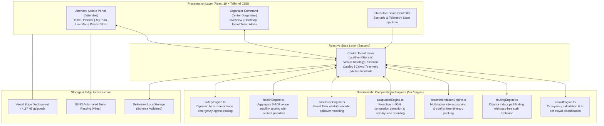

<div align="center">

  

  # MILO

  ### Adaptive Smart Event Experience Platform &amp; Venue Digital Twin

  <p>
    An intelligent, closed-loop event platform that synchronizes real-time physical venue conditions with attendee schedules and organizer operations.
  </p>

  <p>
    <a href="https://milo-two-liart.vercel.app/"><strong>Explore the Live Prototype »</strong></a>
  </p>

  <p>
    <a href="https://milo-two-liart.vercel.app/"></a>
    <a href="https://github.com/Kanneboinashivakumar/MILO"></a>
    <a href="https://www.typescriptlang.org/"></a>
    <a href="https://react.dev/"></a>
    <a href="https://vitejs.dev/"></a>
    <a href="https://tailwindcss.com/"></a>
    <a href="#license"></a>
  </p>

</div>

---

### 🎯 Chosen Vertical
**Smart Event Experience & Large-Scale Operations Platform** — addressing navigation bottlenecks, dynamic overcrowding, accessibility barriers, delayed announcements, and emergency support across multi-zone conferences, hackathons, and exhibitions.

---

## 📌 Problem Statement & The Gap

Anyone who has attended a large conference, summit, or hackathon knows the frustration: you plan your schedule around an anticipated keynote, walk ten minutes across a crowded convention center, and arrive only to find the room packed to maximum capacity with a forty-person line overflowing into the corridor. Meanwhile, the official event app still shows a static schedule and a flat PDF map, completely unaware of what is actually happening on the ground.

Event organizers face the same disconnect from the other side:
- **Blind spots:** Monitoring crowd rushes manually over radio channels, reacting only after bottlenecks have formed.
- **Unseen cascade effects:** An overcrowded main hall inevitably spills foot traffic into adjoining corridors and exits, creating unpredicted safety hazards.
- **Accessibility gaps:** Wheelchair users and attendees with mobility needs discover stairs or blocked pathways without advance rerouting.
- **Static communication:** Generic push notifications sent to all attendees fail to help individuals whose specific itineraries are disrupted.

**MILO bridges this gap.** Instead of acting as a passive digital brochure, MILO connects real-time venue telemetry with attendee schedules in an active, automated feedback loop. When physical conditions change, the digital experience adapts immediately.

---

## 🧠 Approach & Logic

MILO operates on a continuous four-stage closed loop:

$$\text{SENSE (Live Telemetry)} \longrightarrow \text{UNDERSTAND (Impact Analysis)} \longrightarrow \text{ADAPT (Side-by-Side Reroute)} \longrightarrow \text{ACT (1-Click Update)}$$

1. **Sense:** Continuous telemetry monitors zone occupancy percentages, capacity limits, and corridor availability across the 13-zone venue.
2. **Understand:** When a zone reaches critical occupancy ($\ge 90\%$) or is blocked by an incident, MILO identifies affected attendee agendas and recalculates the venue-wide stability score (0–100 Health Score).
3. **Adapt:** Rather than generic alerts, MILO synthesizes personalized alternatives matching attendee interest tags, walking pace, and available time windows.
4. **Act:** Attendees accept itinerary adjustments with a single tap, while organizers deploy simulated countermeasure plans to relieve crowd pressure.

### Why Deterministic Logic?
Safety-critical event operations—such as emergency evacuation routing, crowd threshold enforcement, and step-free accessibility—require absolute predictability, sub-5ms execution, and zero downtime. Rather than relying on non-deterministic external LLMs for core logic, MILO implements **seven pure, deterministic engines** in TypeScript:

| Engine | File | Responsibility |
|---|---|---|
| **Crowd** | `crowdEngine.ts` | Calculates occupancy `(current / capacity) * 100` and classifies into 4 tiers (*Low, Moderate, High, Critical*). |
| **Routing** | `routingEngine.ts` | Dijkstra pathfinding over the 13-zone graph. Prunes `isStairs` edges for wheelchair mode; penalizes congested corridors. |
| **Recommendation** | `recommendationEngine.ts` | Multi-factor session scoring (+10 tag match, -2 walk min, -35 crowd penalty) and conflict-free timeline packing. |
| **Adaptation** | `adaptationEngine.ts` | Scans active agendas against live zone states. Detects $\ge 90\%$ overloads and synthesizes side-by-side alternative picks. |
| **Simulation** | `simulationEngine.ts` | Event Twin digital simulation modeling cascade spillover across adjacent corridors and generating recovery plans. |
| **Health** | `healthEngine.ts` | Computes aggregate 0–100 venue stability score based on critical zones (-15), high crowd (-8), and active hazards (-20). |
| **Safety** | `safetyEngine.ts` | Dynamically routes fleeing attendees to nearest emergency exits while strictly excluding active hazard corridors. |

---

## 🏗️ System Architecture

MILO uses a clean unidirectional reactive data flow: React 19 views dispatch and select state from a centralized Zustand store, which interfaces directly with the seven decoupled computational engines:



---

## ⚙️ How the Solution Works

### 📱 Attendee Experience (`/attendee`)

- **AI Natural Language Planner (`/attendee/planner`):** Attendees enter their time budget and interests in plain English (e.g., *"I have 2 hours and want to focus on AI workshops and mentors"*). MILO parses intent and packs a sequential, conflict-free itinerary with transparent reasoning for every pick.
- **Interactive Itinerary & Plan History (`/attendee/my-plan`):** Displays the active agenda with walk estimates, live crowd badges, and a Plan History archive with 1-click restoration of previous schedules.
- **Live Vector Blueprint Map (`/attendee/map`):** Interactive 13-zone vector venue blueprint with real-time occupancy tiers (*Low, Moderate, High, Critical*), facility filters (*Stages, Restrooms, First Aid*), and Dijkstra indoor routing.
- **Algorithmic Step-Free Navigation:** Toggling **Wheelchair Accessible** strictly prunes stair edges from the pathfinding graph, guaranteeing authentic step-free routes for attendees with mobility requirements.
- **MILO ADAPT (Proactive Rerouting):** When a scheduled room reaches critical occupancy ($\ge 90\%$) or is blocked by an incident, an amber alert card appears showing a **side-by-side comparison** of the congested session vs. a low-crowd alternative covering matching topics. Tapping the button updates the itinerary and navigation path instantly.
- **Protect & Emergency SOS (`/attendee/protect`):** One-tap emergency screen with on-site telephone extensions (*Security: Ext. 911, Medical: Ext. 404, Help Desk: Ext. 101*), designated muster point guidance, and emergency exit routing that dynamically steers clear of active incident zones.

### 🎛️ Organizer Command Center (`/organizer`)

- **Operations Command Center (`/organizer`):** Protected by administrative passcode (`OPS-ADMIN-2026`). Provides venue directors with a single aggregated **Venue Health Score (0–100)**, active headcounts, crowd distribution charts, and live incident feeds.
- **Live Venue Heatmap (`/organizer/live-venue`):** Full-venue spatial visualization displaying real-time occupancy counts, 4-tier color status, and rising/falling crowd velocity indicators.
- **Event Twin Simulation Engine (`/organizer/event-twin`):** An in-memory digital twin of the physical venue. Operators model stress scenarios (*Main Stage Overload, Workshop Room Cancellation, Entrance Bottleneck, Hazard Incident*), inspect projected spillover into adjoining corridors, and review synthesized countermeasure response plans.
- **Automated Response Plans:** The Event Twin generates concrete operational interventions (e.g., re-routing hallway traffic, dispatching overflow staff) accompanied by before-and-after health score projections.
- **Alerts & Live Broadcast Dispatcher (`/organizer/alerts`):** Real-time incident management with 1-click hazard unblocking, plus an instant broadcast publisher that pushes critical announcements to all attendee devices.

---

## 📋 Assumptions Made

1. **Topological Venue Representation:** The venue layout is modeled as an interconnected 13-zone topological graph with defined distances, room capacities, and stair flags rather than GPS coordinates, which are unreliable indoors.
2. **Telemetry Ingestion:** Live crowd sensor counts and occupancy fluctuations are maintained in an in-memory event store. In production, this ingests real-time feeds from overhead optical counters, turnstiles, and Wi-Fi access points; in this prototype, live fluctuations are simulated or injected via the interactive Demo Controller.
3. **Client-Side Edge Execution:** All routing, scheduling, and simulation algorithms execute client-side to ensure zero-latency ($<5\text{ms}$) operation and maintain full functionality even during convention-hall Wi-Fi degradation.
4. **Emergency Boundary:** The Protect & SOS feature provides deterministic on-site exit routing and internal event staff contact points; it does not interface with municipal emergency dispatch systems (911/112).

---

## 🛡️ Evaluation Focus Areas

### 1. Code Quality & Architecture
- **Strict Typing:** 100% TypeScript with zero `any` types across all modules, engines, and store slices.
- **Modularity:** Seven computational engines isolated into pure, side-effect-free functions under `src/engine/`.
- **Runtime Stability:** Custom React ErrorBoundary wrapping the component tree to prevent unhandled exceptions from breaking the UI.

### 2. Security
- **Zero Exposed Secrets:** No sensitive credentials or private API keys committed or required.
- **Defensive Storage:** LocalStorage loaders validate JSON structures against strict TypeScript schemas and sanitize inputs to prevent prototype pollution or corrupted state.
- **HTTP Headers:** Meta tags enforce `X-Content-Type-Options: nosniff` and `Referrer-Policy: strict-origin-when-cross-origin`.

### 3. Efficiency & Performance
- **Minimal Bundle:** Vite production build generates only **117.47 kB gzipped JavaScript** and **6.17 kB gzipped CSS**.
- **Vector Graphics:** Custom responsive SVG blueprint instead of multi-megabyte canvas mapping libraries (Mapbox/Google Maps).
- **Sub-5ms Execution:** Pathfinding, schedule packing, and simulation cascade calculations complete synchronously in under 5 milliseconds.

### 4. Testing & Validation
- **Automated Test Suite:** 83 / 83 tests passing (100% pass rate) across 12 test files using Vitest.
- **Line Coverage:** 100% line coverage on `routingEngine`, `simulationEngine`, `safetyEngine`, `crowdEngine`, and `adaptationEngine`.

### 5. Accessibility (WCAG 2.1 AA)
- **Algorithmic Step-Free Routing:** Dijkstra graph traversal treats stair avoidance as a hard edge exclusion constraint for wheelchair navigation.
- **Keyboard Navigation:** Semantic landmarks, skip-to-content links, `tabIndex`, and `Enter`/`Space` keyboard listeners across all interactive elements.
- **Screen Reader Support:** High-contrast text labels accompanying all crowd color badges, ARIA expanded attributes, and `aria-live="polite"` notification alerts.

---

## 🛠️ Tech Stack

| Domain | Technology | Version | Purpose |
|---|---|---|---|
| **Framework** | React | 19.2 | Declarative component UI and reactive hooks |
| **Language** | TypeScript | 6.0 | Strict static type safety without `any` |
| **Build Tool** | Vite | 8.3 | Sub-second HMR and optimized production rollup |
| **Styling** | Tailwind CSS | 3.4 | High-contrast design system and responsive layout |
| **State Management** | Zustand | 5.0 | Centralized store with schema-validated persistence |
| **Testing** | Vitest | 5.0 | Unit and integration test execution |
| **Testing Helpers** | React Testing Library | 16.3 | Accessible DOM component testing |
| **Deployment** | Vercel Edge | Production | Global CDN hosting with HTTP security headers |

---

## 📂 Project Structure

```text
milo/
├── public/                     # Static branding assets and web icons
│   ├── favicon.svg
│   └── logo.png                # MILO geometric identity logo
├── src/
│   ├── assets/                 # SVGs and UI graphics
│   ├── components/             # Reusable UI primitives (Button, Card, Badge, ErrorBoundary)
│   ├── data/                   # Seed venue topology (13 zones), sessions, and scenarios
│   ├── engine/                 # Seven pure deterministic computational engines
│   │   ├── adaptationEngine.ts # Proactive >=90% congestion detection & rerouting
│   │   ├── crowdEngine.ts      # Utilization % and 4-tier crowd classification
│   │   ├── healthEngine.ts     # Real-time 0-100 venue stability scoring
│   │   ├── promptEngine.ts     # Natural language intent & keyword planner
│   │   ├── recommendationEngine.ts # Multi-factor interest scoring & schedule packing
│   │   ├── routingEngine.ts    # Dijkstra pathfinding with step-free stair exclusion
│   │   ├── safetyEngine.ts     # Dynamic hazard-avoidance emergency egress
│   │   └── simulationEngine.ts # Event Twin what-if cascade spillover modeling
│   ├── features/               # Domain modules (AdaptCard, ResponsePlanCard)
│   ├── pages/
│   │   ├── attendee/           # Attendee views: Home, Planner, MyPlan, LiveMap, Protect
│   │   ├── auth/               # Clean credentials login & organizer passcode gate
│   │   └── organizer/          # Organizer views: Overview, LiveVenue, EventTwin, Alerts
│   ├── store/                  # Centralized Zustand reactive store (useEventStore.ts)
│   ├── types/                  # Strict TypeScript interfaces and discriminated unions
│   ├── App.tsx                 # Route tree with ErrorBoundary wrapper
│   └── main.tsx                # Application mount
├── tests/                      # 12 automated test suites (83 tests passing)
├── package.json
├── tailwind.config.js
├── tsconfig.json
└── vite.config.ts
```

---

## 🚀 Quickstart & Local Setup

### Prerequisites
- [Node.js](https://nodejs.org/) (v18.0.0 or higher recommended)
- npm

### 1. Clone the repository
```bash
git clone https://github.com/Kanneboinashivakumar/MILO.git
cd MILO/milo
```

### 2. Install dependencies
```bash
npm install
```

### 3. Run automated tests
```bash
npm test
```
*Runs all 83 unit and integration tests across 12 test suites.*

### 4. Start the local development server
```bash
npm run dev
```
*Access the application at `http://localhost:5173`.*

### 5. Build for production
```bash
npm run build
```
*Generates an optimized, type-checked production bundle in `dist/`.*

---

## 🔮 Future Roadmap

- **Hardware Sensor Ingestion:** Ingest real-time telemetry from overhead LiDAR/optical sensors, turnstiles, and Wi-Fi access point density logs.
- **Sub-Meter Indoor Positioning:** Bluetooth Low Energy (BLE) and Ultra-Wideband (UWB) beacons for micro-location wayfinding across multi-floor convention centers.
- **Campus & Stadium Scalability:** Extending the topological graph model to support multi-building festival grounds and sports arenas.
- **Web Push Emergency Broadcasts:** Native Web Push API and SMS gateway integration for off-app emergency alerts.

---

<a id="license"></a>
## 📄 License

Distributed under the [MIT License](LICENSE).
