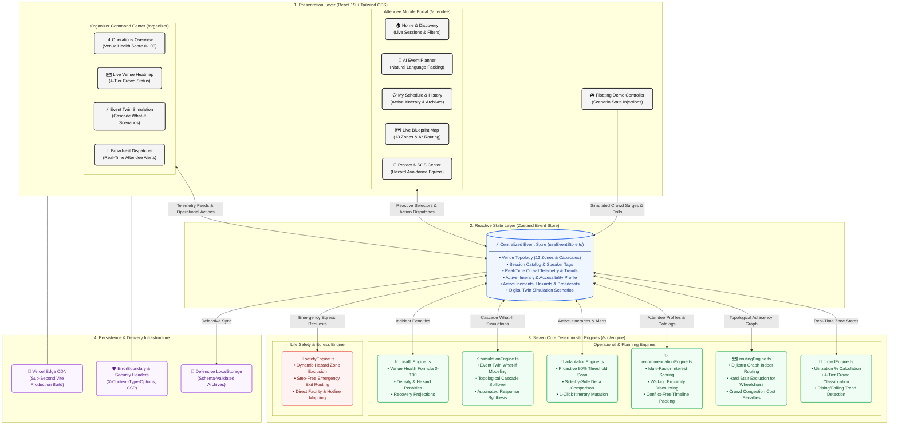

# MILO — Make Every Moment Count

### The event that adapts.

> Traditional event apps tell people what is happening.  
> **MILO adapts when the event changes.**

`	ext
SENSE → UNDERSTAND → ADAPT → ACT
`

MILO is a responsive, web-based **Smart Event Experience Platform** designed for large conferences, hackathons, and exhibitions. Rather than acting as a passive digital brochure, MILO functions as an adaptive event operating system that synchronizes physical venue conditions with attendee schedules and organizer operations in real time.

* **Live Deployment:** [https://milo-two-liart.vercel.app/](https://milo-two-liart.vercel.app/)
* **Repository:** [https://github.com/Kanneboinashivakumar/MILO](https://github.com/Kanneboinashivakumar/MILO)
* **Automated Test Suite:** 83 / 83 Tests Passing (100%) across 12 test files
* **Production Build:** Vite + React 19 + TypeScript (0 errors, ~117 kB gzipped)

---

## 1. Hero Section

Large-scale events are dynamic, physical environments where conditions fluctuate constantly. Keynotes overflow, transit corridors bottle up, sessions shift rooms, and safety incidents emerge without warning.

Conventional event applications are static catalogs: they display schedules, lists of speakers, and static floor plan images. When physical conditions change, they break down. MILO is built around an active feedback loop that senses venue crowd telemetry, understands schedule impact, adapts attendee itineraries proactively, and empowers organizers to simulate and deploy operational interventions.

---

## 2. Problem

Large events present distinct operational and navigation challenges for both attendees and organizers:

### Attendees
* **Confusing Navigation:** Difficulty finding specific stages, breakout rooms, restrooms, food courts, and help desks across multi-zone venues.
* **Overcrowding & Queues:** Arriving at sessions only to find rooms full or corridors jammed.
* **Limited Time:** Struggling to pack relevant sessions into tight schedules without overlapping conflicts or excessive walking distances.
* **Delayed Announcements:** Schedule changes, room swaps, or delays communicated too late.
* **Inaccessible Routes:** Attendees requiring step-free navigation (wheelchair users, attendees with strollers or mobility limitations) encountering stairs or steep obstacles without warning.
* **Emergency Support:** Difficulty quickly locating emergency exits, first-aid stations, or on-site security during incidents.

### Organizers
* **Lack of Real-Time Visibility:** Monitoring venue conditions manually or through fragmented radio channels without a consolidated health metric.
* **Unseen Cascade Effects:** Overcrowding at one main stage cascading into adjacent corridors and exits without early warning.
* **Delayed Incident Response:** Scrambling to formulate manual detours and announcements after bottlenecks have already formed.
* **Maintaining Accessibility:** Ensuring safe, step-free transit corridors remain clear and usable throughout the event lifecycle.

*A static PDF schedule or map is inherently insufficient because an event is not static: when the physical event changes, the digital layer must change with it.*

---

## 3. Solution

MILO bridges the physical reality of the venue with the digital experience of both attendees and organizers through a continuous feedback loop:

`	ext
Event changes
      ↓
MILO senses the change
      ↓
Understands its impact
      ↓
Adapts attendee experience
      ↓
Helps organizers respond
`

MILO connects eight key event dimensions into a unified, reactive state model:
1. **Attendee Intent:** Interests, available time budget, and walking pace.
2. **Session Catalog:** Timing, categories, speaker tags, and zone assignments.
3. **Venue Topology:** An interconnected 13-zone graph with distances, corridors, and facility tags.
4. **Crowd Conditions:** Real-time occupancy percentages, capacity thresholds, and trends.
5. **Temporal Budget:** Start/end times, arrival estimates, and buffer transit windows.
6. **Accessibility Requirements:** Step-free requirements, sensory quiet zones, and companion seating.
7. **Event Safety:** Incident tracking, hazard zones, first-aid navigation, and safe evacuation corridors.
8. **Organizer Interventions:** What-if simulations, crowd redistribution plans, and broadcast announcements.

---

## 4. What Makes MILO Different?

| Traditional Event App | MILO Smart Event OS |
|---|---|
| Shows static schedules | Builds personalized, conflict-free plans based on time & interests |
| Displays a flat, static map graphic | Computes live Dijkstra indoor routes with step-free filters |
| Shows basic crowd labels (if any) | Uses real-time crowd status to proactively adapt attendee schedules |
| Sends generic broadcast notifications | Delivers contextual, targeted schedule adaptation alerts |
| Organizers monitor conditions passively | Organizers simulate scenarios with a Digital Twin and deploy response plans |
| Attendee must manually find alternatives | MILO automatically detects impact and proposes side-by-side solutions |

> **MILO is not simply an event information app. It is an adaptive event experience system.**

The core differentiator is the operational feedback loop:

`	ext
  SENSE       → Live crowd utilization telemetry and venue hazard detection
    ↓
UNDERSTAND    → Impact evaluation on active attendee itineraries and venue health score
    ↓
  ADAPT       → Proactive alternative session recommendations and step-free reroutes
    ↓
   ACT        → Attendee adapts itinerary with 1-click; Organizer executes response plans
`

---

## 5. Core Features

### Attendee Experience (/attendee)
* **AI Event Planner (/attendee/planner):** Natural language schedule generator. Enter interests and time budget (e.g., *"I have 2 hours and want to focus on AI workshops and mentors"*); MILO generates a chronological, conflict-free plan with explainable reasoning for each pick.
* **Sequential Itinerary Selection:** Interactive checkboxes allow attendees to keep the full sequential schedule or toggle specific sessions before saving.
* **My Schedule & Version History (/attendee/my-plan):** Active itinerary dashboard displaying arrival times, walk minutes, crowd status, and a **Plan History Archive** with 1-click plan restoration.
* **Live Blueprint Map (/attendee/map):** Interactive SVG venue map spanning 13 zones with category filter pills (*Stages, Facilities, Restrooms, First Aid*), pulsing *"YOU ARE HERE"* beacon, zone occupancy percentages, and A* indoor route visualization.
* **MILO ADAPT:** Real-time alert card that appears when a scheduled session's room becomes severely congested ($\ge 90\%$) or blocked, displaying a side-by-side Current vs Suggested comparison.
* **Event Discovery (/attendee):** Live session feed with search, category filtering, room capacity metrics, and quick filter chips (*All, Popular, Low Crowd, Accessible Now, Starting Soon*).
* **Live Notification Bell 🔔:** Top navigation bell with unread badge counter and slide-down drawer displaying real-time event broadcasts, schedule delays, and safety bulletins.
* **Protect & SOS Center (/attendee/protect):** Dedicated emergency screen featuring direct telephone extensions (*Security: Ext. 911, Medical Team: Ext. 404, Help Desk: Ext. 101*), muster point guidance, and hazard-avoiding step-free evacuation escape routes.

### Organizer Experience (/organizer)
* **Operations Command Center (/organizer):** Real-time dashboard displaying the **Venue Health Score (-100$)**, total active attendees, crowd density distribution, and active telemetry logs.
* **Live Venue Heatmap (/organizer/live-venue):** Venue-wide spatial view with color-coded crowd tiers, occupancy counts, trend indicators, and zone inspection panels.
* **Event Twin Simulation (/organizer/event-twin):** Digital twin engine allowing operators to select scenarios (*Main Stage Overload, Workshop Cancellation, Entrance Bottleneck, Emergency Incident*) and simulate cascade crowd propagation across connected corridors.
* **Automated Response Plans:** The Event Twin generates actionable interventions (e.g., redirect traffic to corridor B, dispatch overflow staff) with before-and-after health score projections.
* **Alerts & Real-Time Broadcasts (/organizer/alerts):** Incident log management with one-click resolution/unblocking, plus an instant **Live Broadcast Dispatcher** to push announcements to all attendee devices.
* **Organizer Passcode Gate:** Protected by an administrative passcode modal (OPS-ADMIN-2026).

---

## 6. Signature Demo: MILO in Action

The canonical judging demonstration flows through the complete adaptive cycle:

`	ext
1.  Attendee signs in as Alex and opens the AI Planner.
2.  Enters: "I have 2 hours and want to focus on hackathon AI workshops and mentors."
3.  MILO computes a personalized sequential plan (Keynote Kickoff → AI Agent Architecture).
4.  Attendee saves the schedule to "My Plan".
5.  Attendee views the Live Map; the route is highlighted on the 13-zone blueprint.
6.  Demo Controller triggers "Main Stage Overload" (simulating 95% critical congestion).
7.  MILO SENSES the crowd surge and UNDERSTANDS that Alex's upcoming session is impacted.
8.  An amber alert appears: "Your plan needs attention".
9.  Attendee opens the Adapt Card: MILO presents CURRENT (Main Stage, 95% crowd, 4m walk) 
    vs SUGGESTED (Workshop Stage A, 42% crowd, 2m walk).
10. Attendee selects "Switch to Suggested Session & Adapt Plan".
11. The active itinerary updates instantly; the route and room swap cleanly.
12. Switch to Organizer view (Sarah logs in with passcode OPS-ADMIN-2026).
13. Organizer observes that Event Health has dropped due to congestion.
14. Organizer opens Event Twin, selects "Main Stage Overload", and clicks "Run Simulation".
15. MILO calculates cascade spillover into the Central Corridor and generates a Response Plan.
16. Organizer clicks "Apply Response Plan"; venue health improves from 58 to 86.
17. Attendee opens Protect/SOS; safe evacuation routing steers around active hazard zones.
`

This sequence proves that MILO is an active, closed-loop event operating system rather than a static visual prototype.

---

## 7. Architecture

MILO is built with a unidirectional reactive data flow centered around a centralized Zustand event state store and seven decoupled deterministic engines:

---

## 8. Seven Core Engines

All core logic resides in `/src/engine/` as pure, testable, deterministic modules:

### 1. `crowdEngine.ts`
* **Purpose:** Computes zone utilization percentages and assigns crowd status classifications.
* **Behavior:** Evaluates `(currentCrowd / capacity) * 100`, assigns status tiers, and tracks rising/falling occupancy trends.
* **Why It Exists:** Provides the baseline telemetry used by routing, adaptation, and health scoring.

### 2. `routingEngine.ts`
* **Purpose:** Indoor venue graph pathfinding respecting crowd density and physical accessibility.
* **Behavior:** Implements Dijkstra's algorithm over the 13-zone adjacency graph. Hard-prunes edges where `isStairs: true` when `avoidStairs` or `wheelchairAccessible` is enabled. Penalizes congested corridors ($0.05 \times \text{utilization above } 50\%$) and excludes blocked zones (`penalty: 9999`).
* **Why It Exists:** Guarantees that attendees receive practical walking times and authentic step-free routes.

### 3. `recommendationEngine.ts`
* **Purpose:** Personalizes session recommendations and packs conflict-free itineraries.
* **Behavior:** Ranks sessions using a multi-factor formula: matching attendee interest tags (+10), subtracting walking transit penalties (-2 per minute), penalizing high crowd levels (-15 for >75%, -35 for >90%), and enforcing accessibility compliance. Fits sessions sequentially within the attendee's available time window.
* **Why It Exists:** Eliminates manual schedule sorting and creates tailored, feasible daily agendas.

### 4. `adaptationEngine.ts`
* **Purpose:** Detects itinerary conflicts caused by real-time venue changes and proposes alternatives.
* **Behavior:** Scans the active itinerary against live zone states. If a scheduled session's room crosses 90% occupancy or becomes blocked, it identifies alternative sessions in lower-crowd zones matching the attendee's profile, calculating before-and-after crowd and transit metrics.
* **Why It Exists:** Ensures attendees do not walk into overcrowded or cancelled sessions.

### 5. `simulationEngine.ts`
* **Purpose:** Powers the organizer's Event Twin digital simulation.
* **Behavior:** Models what-if scenarios by projecting crowd surges into connected topological corridors based on adjacency weights. Evaluates cascade risk and synthesizes multi-action response plans.
* **Why It Exists:** Allows operators to anticipate bottlenecks and test interventions before crowds arrive.

### 6. `healthEngine.ts`
* **Purpose:** Quantifies aggregate venue operational stability into a single metric (0–100).
* **Behavior:** Starts at 100 and applies weighted penalties: critical crowd zones (-15), high crowd zones (-8), active incidents (-20), and blocked zones (-10). Clamped strictly between 0 and 100.
* **Why It Exists:** Gives venue directors an instant, objective indicator of overall event stability.

### 7. `safetyEngine.ts`
* **Purpose:** Governs emergency evacuation and facility location during incidents.
* **Behavior:** Finds the nearest exit or first-aid station while dynamically pruning active hazard/incident zones from the routing graph. Maintains step-free constraints during emergency routing.
* **Why It Exists:** Prevents evacuation routes from directing fleeing attendees through dangerous or blocked areas.

---

## 9. Intelligence & Algorithms

All mission-critical calculations in MILO are **fully deterministic**:

### Crowd Classification Thresholds
`	ext
  0% – 49%   → LOW       (Optimal conditions, normal transit)
 50% – 74%   → MODERATE  (Steady flow, monitor capacity)
 75% – 89%   → HIGH      (Approaching saturation, routing penalty applied)
 90% – 100%+ → CRITICAL  (Severe overcrowding, triggers proactive adaptation)
`

### Routing Cost Function
\text{Cost}(u, v) = \text{BaseWalkMinutes}(u, v) + \text{CrowdPenalty}(v) + \text{BlockedPenalty}(v)
Where:
* $\text{CrowdPenalty}(v) = 0.05 \times \max(0, \text{UtilizationPct}(v) - 50)$
* If $\text{Zone}(v).\text{isBlocked} = \text{true}$, then $\text{Cost} = 9999$
* If $\text{Attendee}.\text{wheelchairAccessible} = \text{true}$ and $\text{Edge}(u, v).\text{isStairs} = \text{true}$, then $\text{Cost} = \infty$ (Edge is excluded)

### Recommendation Scoring Formula
\text{Score}(S) = 50 + (10 \times |\text{Tags}(S) \cap \text{Interests}|) - (2 \times \text{WalkMinutes}) - \text{CrowdPenalty}
Where $\text{CrowdPenalty} = 35 \text{ if } \ge 90\%, \text{ else } 15 \text{ if } \ge 75\%, \text{ else } 0$.

### Event Health Formula
\text{Health} = \max(0, \min(100, 100 - (15 \times N_{\text{critical}}) - (8 \times N_{\text{high}}) - (20 \times N_{\text{incidents}}) - (10 \times N_{\text{blocked}})))

---

## 10. AI Architecture

### Deterministic-First Intelligence Architecture
Safety-critical event operations—such as emergency evacuation routing, crowd capacity thresholding, and step-free accessibility enforcement—must be verifiable, instantaneous, and resilient against network outages. 

MILO adopts a **Deterministic-First Architecture**:
* **Deterministic Core:** Pathfinding (Dijkstra), crowd classification, itinerary packing, adaptation matching, health scoring, and cascade simulation execute synchronously in pure TypeScript with zero network latency ($< 5\text{ms}$).
* **Natural Language Processing (promptEngine.ts):** Attendee prompt planning and organizer commands are processed via a deterministic keyword/intent tokenizer with regex pattern matching. It runs entirely offline on the client.
* **Optional LLM Proxy Integration:** A template configuration exists in .env.example (VITE_LLM_API_KEY) to route complex freeform prose queries to an external LLM proxy if desired; however, **no external LLM is required for any core feature, test, or demonstration.**

---

## 11. Event Twin

The Event Twin is an in-memory digital twin of the physical venue:
* **What-If Exploration:** Operators can trigger simulated stresses before making live venue changes.
* **Supported Scenarios:** Main Stage Overload, Workshop Room Cancellation, East Entrance Bottleneck, and Hazard Incident.
* **Cascade Impact Calculation:** Evaluates which downstream corridors and adjoining rooms will absorb spilled foot traffic.
* **Actionable Response Plans:** Generates concrete operational directives (e.g., re-route hallway signage, open secondary doors, adjust schedule buffers) with estimated health score recovery.

> *Event Twin lets organizers explore how a changing venue condition could affect the wider event before applying an intervention.*

---

## 12. MILO Adapt

MILO ADAPT is the primary attendee-facing manifestation of the intelligent cycle:

`	ext
Live Event Change (e.g., Main Stage exceeds 90% crowd)
       ↓
Impact Detection (adaptationEngine scans active itinerary)
       ↓
Affected Itinerary Item Identified
       ↓
Alternative Matching (locates compatible sessions in low-crowd zones)
       ↓
Side-by-Side Comparison (CURRENT vs SUGGESTED presented with metrics)
       ↓
Attendee taps "Switch to Suggested Session & Adapt Plan"
       ↓
Itinerary & Map route update seamlessly
`

### Real Example:
* **CURRENT:** Main Stage Keynote &middot; **95% crowded (Critical)** &middot; 4 min walk
* **SUGGESTED:** Workshop Hall A &middot; **42% crowded (Low)** &middot; 2 min walk
* **Benefits:** 53% lower crowd density, 2 minutes less walking, covers matching AI/ML tags.

---

## 13. Safety & SOS

* **One-Tap Emergency Mode:** Floating SOS button on all attendee views navigates directly to /attendee/protect.
* **Dynamic Hazard Exclusion:** When an incident is active in a zone, that zone is immediately flagged as blocked and avoided by all navigation calculations.
* **Safe Evacuation Paths:** Computes step-free egress routes to the nearest designated emergency exits or muster points.
* **On-Site Emergency Hotlines:** Direct dial contacts for Security (Ext. 911), Medical Support (Ext. 404), and the Help Desk (Ext. 101).
* **Prototype Boundary:** MILO provides deterministic safe on-site routing and staff contact points; it does not connect to municipal emergency dispatch services (911/112).

---

## 14. Accessibility

MILO is designed around **WCAG 2.1 Level AA principles**:
* **Algorithmic Step-Free Navigation:** Physical accessibility is integrated into the routing graph. Toggling wheelchair or stair avoidance prunes non-accessible edges, guaranteeing step-free paths.
* **Full Keyboard Operability:** All interactive cards, modal options, and itinerary selectors include semantic 
ole="button", 	abIndex={0}, and Enter/Space keyboard listeners.
* **Bypass Blocks:** Semantic "Skip to main content" links (#main-content) on Attendee and Organizer layouts.
* **Color Blindness Support:** Status indicators use high-contrast text labels (*Low, Moderate, High, Critical*) alongside color badges.
* **Screen Reader Semantics:** ARIA landmarks (<header>, <nav>, <main>, <aside>), ria-expanded toggles on drawers, and ria-live="polite" / 
ole="alert" announcements for real-time broadcasts.

---

## 15. Security

* **Zero Secret Exposure:** No private API keys or sensitive backend credentials are committed or required.
* **Safe DOM Rendering:** Zero usage of dangerouslySetInnerHTML or eval().
* **Defensive Storage Verification:** Local storage loaders validate JSON structures against strict TypeScript schemas and sanitize string lengths (max 100 characters) to prevent corrupted state or prototype pollution.
* **Privileged Operations Gate:** Organizer Command Center is protected by an administrative passcode modal (OPS-ADMIN-2026).
* **HTTP Security Headers:** Meta tags in index.html enforce X-Content-Type-Options: nosniff and Referrer-Policy: strict-origin-when-cross-origin.
* **Runtime Resilience:** A custom React ErrorBoundary wraps the component tree to contain rendering exceptions and prevent blank white screens.

---

## 16. Tech Stack

| Layer | Technology | Version | Purpose |
|---|---|---|---|
| **Runtime / UI** | React | ^19.2.8 | Declarative UI component architecture |
| **Language** | TypeScript | ~6.0.2 | End-to-end static type safety without ny |
| **Build Tool** | Vite | ^8.3.0 | Ultra-fast development server & production bundler |
| **Routing** | React Router | ^7.18.3 | Client-side routing with nested layout trees |
| **State Management** | Zustand | ^5.0.15 | Lightweight centralized reactive store |
| **Styling** | Tailwind CSS | ^3.4.19 | High-contrast, utility-first design system |
| **Testing** | Vitest | ^5.0.0 | Fast unit & integration test runner |
| **Testing Utilities** | Testing Library | ^16.3.3 | DOM and component test helpers |
| **Coverage Engine** | @vitest/coverage-v8 | ^5.0.0 | V8 native code coverage reporting |

---

## 17. Project Structure

`	ext
milo/
├── public/                     # Static assets (brand logo, icons)
├── src/
│   ├── assets/                 # SVGs and UI graphics
│   ├── components/             # Reusable UI primitives (Button, Card, Badge, ErrorBoundary)
│   ├── data/                   # Seed venue topology (13 zones), sessions, and scenarios
│   ├── engine/                 # Seven pure deterministic computational engines
│   │   ├── adaptationEngine.ts
│   │   ├── crowdEngine.ts
│   │   ├── healthEngine.ts
│   │   ├── promptEngine.ts
│   │   ├── recommendationEngine.ts
│   │   ├── routingEngine.ts
│   │   └── safetyEngine.ts
│   ├── features/               # Domain-specific modules (AdaptCard, ResponsePlanCard)
│   ├── pages/
│   │   ├── attendee/           # Attendee views: Home, Planner, MyPlan, LiveMap, Protect
│   │   ├── auth/               # Clean credentials login & organizer passcode gate
│   │   └── organizer/          # Organizer views: Overview, LiveVenue, EventTwin, Alerts
│   ├── store/                  # Centralized Zustand reactive store (useEventStore.ts)
│   ├── types/                  # Strict TypeScript interfaces and discriminated unions
│   ├── App.tsx                 # Route tree with ErrorBoundary wrapper
│   └── main.tsx                # React root bootstrap
├── tests/                      # 12 automated test suites (83 tests)
├── index.html                  # HTML5 entry with security meta headers
├── tailwind.config.js          # High-contrast color palette and elevation tokens
├── tsconfig.json               # Strict TypeScript compiler options
└── vite.config.ts              # Vite build configuration
`

---

## 18. Testing & Quality

Run the complete test suite locally:

`ash
npm test
`

### Verified Test Results
* **Test Files:** 12 passed (12 total)
* **Tests:** 83 passed (83 total &middot; **100% pass rate**)
* **Execution Time:** ~4.5 seconds

### Verified Coverage Highlights (V8 Engine)
* 
outingEngine.ts: **100% Line Coverage**
* simulationEngine.ts: **100% Line Coverage**
* safetyEngine.ts: **100% Line Coverage**
* crowdEngine.ts: **100% Line Coverage**
* daptationEngine.ts: **100% Line Coverage**
* 
ecommendationEngine.ts: **98.96% Line Coverage**
* Overall Engine Line Coverage: **90.06%**

---

## 19. Performance

* **Zero Map SDK Dependencies:** Uses lightweight, responsive SVG for the venue blueprint rather than multi-megabyte canvas mapping libraries (e.g., Mapbox or Google Maps).
* **Minimal Payload:** Production bundle delivers only **117 kB gzipped JavaScript** and **6.1 kB gzipped CSS**.
* **Sub-Second Production Build:** Full TypeScript validation and Vite bundling compiles in **~1.1 seconds**.
* **Client-Side Synchronous Computation:** Pathfinding, schedule generation, and simulation calculations finish in **under 5 milliseconds**, eliminating UI thread jank.

---

## 20. Setup & Local Development

### Prerequisites
* Node.js (v18+ recommended)
* npm

### Step-by-Step Instructions
`ash
# 1. Clone repository
git clone https://github.com/Kanneboinashivakumar/MILO.git
cd MILO

# 2. Install dependencies
npm install

# 3. Run automated tests
npm test

# 4. Validate TypeScript type safety
npm run lint

# 5. Build for production
npm run build

# 6. Start local development server
npm run dev
`

The application will be accessible at [http://localhost:5173](http://localhost:5173).

---

## 21. Environment Variables

> **MILO runs entirely out of the box in demo mode with zero required external API keys or environment variables.**

An optional .env.example file is included for completeness:
`ash
# Optional: External LLM proxy (Not required for core demo or evaluation)
# VITE_LLM_API_KEY=your_key_here
`

---

## 22. Demo Controls

A floating **⚡ Demo Controller** widget is pinned to the bottom of the interface to facilitate live judging walkthroughs:
* **Main Stage Overload:** Sets Main Stage crowd to 95% critical congestion and triggers the attendee adaptation loop.
* **Emergency:** Initiates an active emergency incident in the Central Corridor, testing hazard avoidance routing.
* **Cancel Session:** Simulates sudden session cancellation to test itinerary alerts.
* **Congest Entrance:** Surges the East Entrance to test organizer cascade simulations.
* **Toggle Live Pulse:** Toggles real-time simulated telemetry fluctuations every 4 seconds.
* **Reset Demo:** Clears active incidents and restores initial seed states.

---

## 23. Recommended 2-Minute Judge Demo

Follow this sequence to present the complete MILO product story in two minutes:

1. **Sign In (/login):** Select **Alex (Attendee)** &rarr; click **Sign In**.
2. **AI Planner (/attendee/planner):** Click the prompt template *"💻 2h Hackathon Sprint"* &rarr; click **Build my plan**. Point out that both sessions are selected in sequence with explainable AI reasoning.
3. **Save Schedule:** Click **Save 2 Sessions to My Plan**. Show the active schedule and the **Plan History** archive tab.
4. **Live Map (/attendee/map):** Show the 13-zone blueprint, toggle **Wheelchair Accessible**, and note how the A* path dynamically routes around stairs.
5. **Trigger Overload:** In the Demo Controller, click **Main Stage Overload**. Show the amber banner *"Your plan needs attention"*.
6. **Adapt Itinerary:** Open the Adapt Card. Show the side-by-side comparison of **Current** vs **Suggested**, and click **Switch to Suggested Session**. The itinerary updates immediately.
7. **Organizer Command Center (/organizer):** Click **Log Out** &rarr; select **Sarah (Organizer)** &rarr; enter passcode OPS-ADMIN-2026.
8. **Digital Twin Simulation (/organizer/event-twin):** Select **Main Stage Overload** &rarr; click **Run Simulation**. Show the cascade spillover across connected zones and click **Apply Response Plan** to improve Event Health.
9. **Emergency SOS (/attendee/protect):** Show the direct emergency phone contacts and the step-free escape route avoiding active hazard zones.

---

## 24. Demo Data & Limitations

### Simulated
* Real-time visitor counts, zone sensor pulses, and crowd percentages are generated within an in-memory event store.
* Venue layout is modeled on an indoor 13-zone topological blueprint.

### Prototype Boundaries
* **No Real Emergency Dispatch:** SOS Protect provides deterministic on-site exit routing and telephone extensions; it does not connect to municipal 911 services.
* **No Physical Beacons:** Indoor positioning uses graph topological proximity rather than physical BLE or UWB hardware beacons.

---

## 25. Design Philosophy

* **Clean & Calm:** A restrained, high-contrast monochrome aesthetic (#111110 text on #FFFFFF canvas) engineered for clarity in noisy, brightly lit exhibition halls.
* **Operational Typography:** Clear tabular data, prominent numerical stats, and unambiguous status badges.
* **Restrained Accents:** Vibrant ember and amber accents reserved exclusively for actionable alerts and critical congestion warnings.

---

## 26. Future Scope

1. **Hardware Telemetry Integration:** Ingesting live feeds from overhead optical crowd sensors, turnstiles, and Wi-Fi access point density logs.
2. **UWB/BLE Indoor Positioning:** Micro-location positioning for sub-meter turn-by-turn wayfinding.
3. **Multi-Venue Scalability:** Extending the topological graph model to multi-building convention centers and stadium campuses.
4. **Automated Push Notifications:** Web Push API and SMS broadcast integration for off-app emergency alerts.

---

## 27. Why MILO?

Most event platforms answer:
> **"What's happening?"**

MILO answers:
> **"What should happen next?"**

# When the event changes, MILO changes with it.

---

*Built with precision for the Smart Event Experience Hackathon 2026.*
