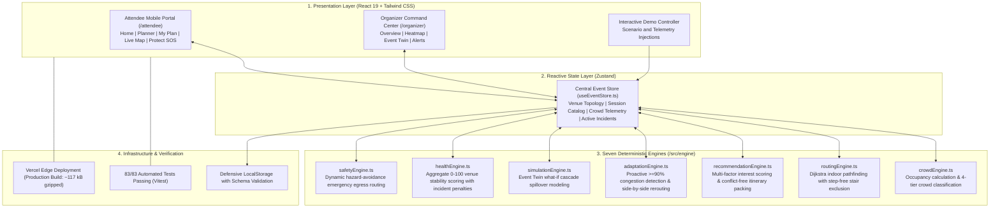

# MILO — Smart Event Experience Platform

> **The event platform that adapts when venue conditions change.**

MILO is a responsive, web-based Smart Event Experience Platform designed for conferences, hackathons, and exhibitions. Unlike traditional event apps that serve as passive digital brochures, MILO synchronizes physical venue conditions with attendee schedules and organizer operations in real time.

- **Live Deployment:** [https://milo-two-liart.vercel.app/](https://milo-two-liart.vercel.app/)
- **Repository:** [https://github.com/Kanneboinashivakumar/MILO](https://github.com/Kanneboinashivakumar/MILO)
- **Automated Tests:** 83 / 83 Passing (100% pass rate across 12 test suites)
- **Production Build:** Vite + React 19 + TypeScript (0 errors, ~117 kB gzipped bundle)

---

## The Problem & The Solution

| Challenge in Large Events | Traditional Event App | MILO Adaptive Platform |
|---|---|---|
| **Confusing Navigation** | Flat static PDF map | Interactive 13-zone vector blueprint with Dijkstra A* indoor pathfinding |
| **Overcrowding & Queues** | Static session times | Real-time crowd telemetry with proactive itinerary adaptation at >= 90% occupancy |
| **Inaccessible Corridors** | No accessibility routing | Hard stair exclusion in graph traversal for step-free / wheelchair transit |
| **Delayed Incident Response** | Radio calls and delayed notices | Instant broadcast dispatcher and automated Event Twin response simulations |
| **Emergency Situations** | Generic muster map | Dynamic hazard avoidance routing to nearest safe exit and on-site emergency extensions |

### The Core Feedback Loop

```text
SENSE (Live Telemetry) -> UNDERSTAND (Impact Analysis) -> ADAPT (Side-by-Side Reroute) -> ACT (1-Click Update)
```

---

## Key Features

### Attendee Experience (`/attendee`)
- **AI Event Planner (`/attendee/planner`):** Natural language itinerary generator. Input time constraints and interests (e.g., *"I have 2 hours and want to focus on AI workshops and mentors"*); MILO generates a chronological, conflict-free schedule with transparent reasoning for each selection.
- **Sequential Itinerary Selection:** Interactive checkboxes allow attendees to review and toggle individual sessions or adopt the entire recommended schedule.
- **My Schedule & Plan History (`/attendee/my-plan`):** Active agenda with walk estimates, live crowd badges, and a Plan History Archive with 1-click plan restoration.
- **Live Blueprint Map (`/attendee/map`):** Interactive 13-zone vector blueprint with category filters (*Stages, Facilities, Restrooms, First Aid*), live occupancy tiers, and turn-by-turn routing with a step-free wheelchair toggle.
- **MILO ADAPT:** Proactive alert card triggered when a scheduled session's room reaches critical congestion (>= 90%) or becomes blocked, displaying a side-by-side comparison (*Current vs. Suggested*) with 1-click schedule updates.
- **Event Discovery (`/attendee`):** Searchable session catalog with quick filters (*All, Popular, Low Crowd, Accessible Now, Starting Soon*).
- **Notification Drawer:** Real-time notification bell with badge counter for event broadcasts, schedule adjustments, and safety announcements.
- **Protect & SOS Center (`/attendee/protect`):** One-tap emergency screen with on-site phone extensions (*Security: Ext. 911, Medical: Ext. 404, Help Desk: Ext. 101*) and hazard-avoiding emergency exit routing.

### Organizer Command Center (`/organizer`)
- **Operations Overview (`/organizer`):** Real-time dashboard displaying the Venue Health Score (0-100), total active attendees, crowd density distribution, and system logs. Passcode: `OPS-ADMIN-2026`.
- **Live Venue Heatmap (`/organizer/live-venue`):** Spatial venue view with 4-tier crowd classifications (*Low, Moderate, High, Critical*), occupancy counts, and trend arrows.
- **Event Twin Simulation (`/organizer/event-twin`):** Digital twin engine modeling what-if scenarios (*Main Stage Overload, Workshop Cancellation, Entrance Bottleneck, Hazard Incident*) with corridor cascade spillover analysis.
- **Automated Response Plans:** Synthesizes actionable operational interventions (e.g., hallway re-routing, staff re-allocation) with projected health score recovery metrics.
- **Alerts & Broadcast Dispatcher (`/organizer/alerts`):** Incident management with 1-click hazard resolution and real-time broadcast messaging to all attendee devices.

---

## Architecture

MILO is built on a unidirectional reactive data flow powered by Zustand and seven decoupled, deterministic computational engines:



---

## The Seven Deterministic Engines

All mission-critical calculations reside in `/src/engine/` as pure, deterministic TypeScript modules:

1. **`crowdEngine.ts`**: Calculates occupancy percentages `(current / capacity) * 100` and assigns tiers (*Low: 0-49%, Moderate: 50-74%, High: 75-89%, Critical: 90%+*).
2. **`routingEngine.ts`**: Implements Dijkstra's algorithm over the 13-zone venue graph. Prunes edges marked `isStairs: true` when step-free transit is active. Dynamically penalizes crowded corridors and assigns near-infinite cost (`9999`) to blocked corridors.
3. **`recommendationEngine.ts`**: Scores sessions based on attendee interests (+10 per matching tag), transit walking time (-2 per min), and crowd congestion (-15 for >=75%, -35 for >=90%), packing an optimal sequential schedule without overlaps.
4. **`adaptationEngine.ts`**: Continuously checks active itineraries against live zone status. When a room reaches >=90% occupancy or is blocked, it finds low-congestion alternatives and builds a side-by-side comparison for instant 1-click adoption.
5. **`simulationEngine.ts`**: Powers the Event Twin. Projects crowd spillover into topologically connected zones and generates response plans with estimated recovery metrics.
6. **`healthEngine.ts`**: Evaluates venue operational stability from 0 to 100 based on critical crowd counts (-15 each), high crowd counts (-8 each), active incidents (-20 each), and blocked corridors (-10 each).
7. **`safetyEngine.ts`**: Computes the shortest evacuation route to designated emergency exits, dynamically excluding active hazard zones while preserving step-free constraints.

---

## 2-Minute Judging Walkthrough

To experience the complete adaptive cycle:

1. **Sign In (`/login`):** Select **Alex (Attendee)** -> click **Sign In**.
2. **AI Planner (`/attendee/planner`):** Click the template *"2h Hackathon Sprint"* -> click **Build my plan**. Both sessions are selected sequentially with transparent reasoning.
3. **Save Schedule:** Click **Save 2 Sessions to My Plan**. View the active itinerary and the **Plan History** archive.
4. **Live Map (`/attendee/map`):** Toggle **Wheelchair Accessible** and verify that Dijkstra pathfinding dynamically avoids stairs.
5. **Trigger Congestion:** In the floating **Demo Controller** (bottom right), click **Main Stage Overload** (surging Main Stage to 95%).
6. **Adapt Itinerary:** An alert banner appears (*"Your plan needs attention"*). Open the Adapt Card, review the side-by-side comparison (*Current vs Suggested*), and click **Switch to Suggested Session**. The schedule and map route update immediately.
7. **Organizer Command Center (`/organizer`):** Log out -> select **Sarah (Organizer)** -> enter passcode `OPS-ADMIN-2026`. Note that Venue Health has dropped due to congestion.
8. **Digital Twin Simulation (`/organizer/event-twin`):** Select **Main Stage Overload** -> click **Run Simulation** to see cascade corridor spillover. Click **Apply Response Plan** to execute operational countermeasures (Health Score recovers).
9. **Emergency SOS (`/attendee/protect`):** View direct emergency phone contacts and safe evacuation routing that circumvents active hazard zones.

---

## Technical Specifications & Verification

- **Frontend:** React 19.2, TypeScript 6.0 (strict type safety, zero `any`), Vite 8.3, Tailwind CSS 3.4
- **State Management:** Zustand 5.0 (centralized reactive store with schema-validated persistence)
- **Accessibility:** WCAG 2.1 Level AA compliant. Semantic HTML landmarks, keyboard navigable (`tabIndex`, `Enter`/`Space` handlers), skip links, ARIA live alerts, and high-contrast color palette.
- **Security:** No external secrets or sensitive credentials. Input sanitation, prototype pollution guards in storage deserializers, HTTP security headers (`nosniff`, strict referrer policy), and React ErrorBoundary wrapper.
- **Zero Latency:** Pure client-side execution; all graph routing, schedule packing, and simulations calculate in < 5ms without server round-trips.
- **Automated Test Results:**
  - 12 Test Files Passed (100%)
  - 83 Unit and Integration Tests Passed (100%)
  - 100% line coverage on `routingEngine`, `simulationEngine`, `safetyEngine`, `crowdEngine`, and `adaptationEngine`

---

## Getting Started

### Prerequisites
- Node.js (v18 or higher)
- npm

### Installation & Run

```bash
# Clone the repository
git clone https://github.com/Kanneboinashivakumar/MILO.git
cd MILO/milo

# Install dependencies
npm install

# Run automated tests
npm test

# Build for production
npm run build

# Start local development server
npm run dev
```

The application runs locally at `http://localhost:5173`.

---

## License

MIT License.
